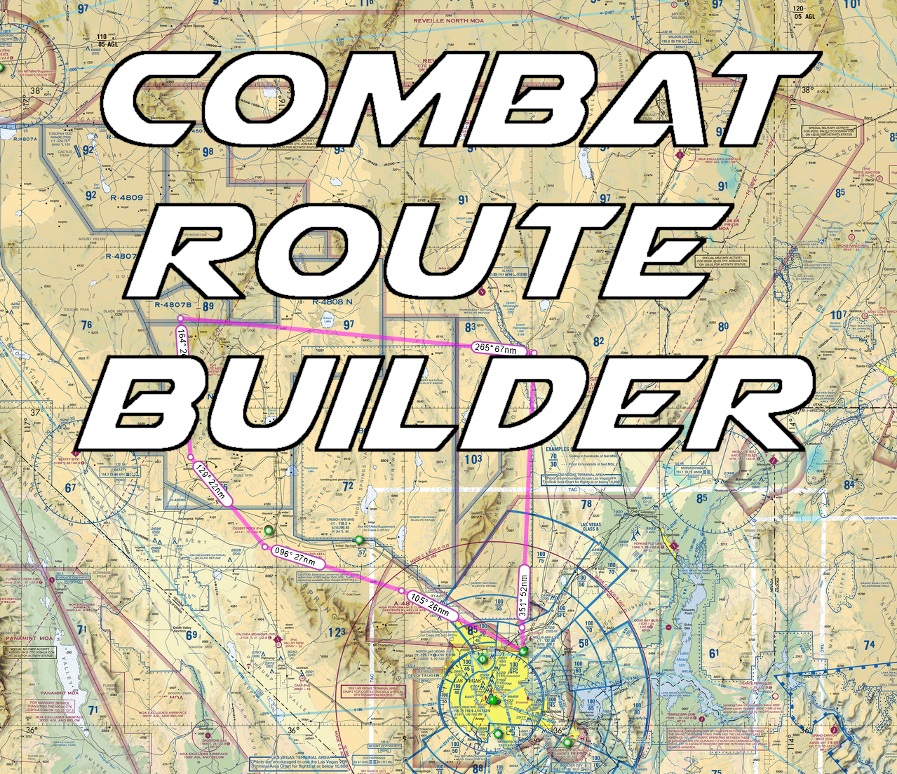

# Combat Route Builder

  
A route builder for use with .fpl files and DCS' Route Tool.

## Documentation

Combat Route Builder loads user created Garmin .fpl files, converts them to DCS' required format, and then exports them to the DCS Route Tool.  As of this writing, the DCS Route Tool only works in multiplayer, hence this application is only useful for multiplayer sessions.

### Requirements
- [Microsoft .NET 8](https://dotnet.microsoft.com/en-us/download)
- a properly formatted .fpl file
- a valid path to 'Saved Games/DCS/Config/RotueToolPresets'

### Steps
1. Download and extract the CombatRouteBuilder folder to any folder of your choosing, of which you have write permissions.

2. Run the CombatRouteBuilder.exe file.  On first launch the app will do a few things:
- Prompt the user to select their 'Saved Games/DCS' folder.  This is not your DCS installation folder, but rather located in your user folder. (%userprofile%\Saved Games\DCS)
- Create a 'fpl' subdirectory for flight plan storage and ease of discovery.
- Create a settings file that points to your 'Saved Games/DCS' folder.

3. Next you must create/acquire an .fpl file. 
I recommend using [SkyVector](https://www.skyvector.com), but there are other sources.  It's free and no account is necessary:
- Build a flight plan, including departure and destination airports.
- Use SkyVector's export feature to download the .fpl file
- Place the .fpl file in the 'CombatRouteBuilder/fpl' folder for ease of discovery. (optional)
  

  
4. In the CRB window click 'Load FPL' and navigate to, then select, your .fpl file. If the file is properly formatted a few things should happen:
- Waypoints from your flight plan should populate the CRB Data Grid.
- If the first fix (airport, or waypoint if airport omitted) lies within the confines of a recognized map, the region section should display the map name.  If it does not, the waypoint may lie outside the confines of the map and CRB will not export.  This is only true for the first waypoint of a flight plan[^1].

5. You can now enter any desired paramaters such as waypoint altitude, altitude type (Barometric or Radio), ETA, etc.  Also, the name of the route should automatically populate.  If you prefer a different name, you can use the provided text box to rename the route.  Check for any red boxes around any cells for improperly formatted data.  If you want to start over you can either press the 'Clear Route' button or reload a .fpl file.

6. When finished, you can export your route to the DCS Route Tool via the 'Export to DCS' button.  If a route with the same Route Name already exists, CRB will prompt you to overwrite it.  If there is another issue, the problem should be reflected in the status bar.

7. Launch DCS, join a multiplayer server, and your route should be available via the Route Tool drop down.

[^1]: When planning the first waypoint (Waypoint index 0) of a flight plan, CRB looks for the departure airport.  If none is provided via the .fpl file, it should utilize the first waypoint as index 1.  This is because of the convention in DCS that Waypoint 0 should always be the departure airport, which is selected by the user in the game.

## FAQ

#### How can I create an .fpl file?

There are many ways to acquire .fpl files. This program was initially designed to work with [SkyVector](https://skyvector.com) (see documentation), but there are others. You can also convert exisiting flight plans created with other simulators to the .fpl file format using converters like [this one](https://fpc.kognise.dev/).

#### What other features are you planning in the future?

None, really. This project was meant to be a one off, to simplify a way to bridge real world navigation and the DCS Route Tool. There may be additions, if I see fit, but don't hold your breath.

#### Do you plan on supporting other DCS maps?

Map support relies on specific data for DCS' [mercator projection](https://en.wikipedia.org/wiki/Mercator_projection) that I was able to source from other projects.  If you have that data, specifically DCS' (or the map developer's) defined central meridian & false northing/easting for the map, let me know and I can add it.  It is possible to source this yourself via DCS' scripting engine, however you must have the specific map to do it, as far as I know.

#### Why is your code so bad?

I fly airplanes for a living and am not classically trained as a programmer.  Go fork yourse...err I mean you can fork the project yourself. 😉
## Demo

Insert gif or link to demo

## License

[MIT](https://choosealicense.com/licenses/mit/)

